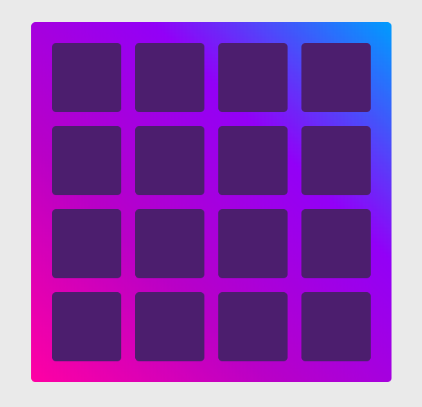
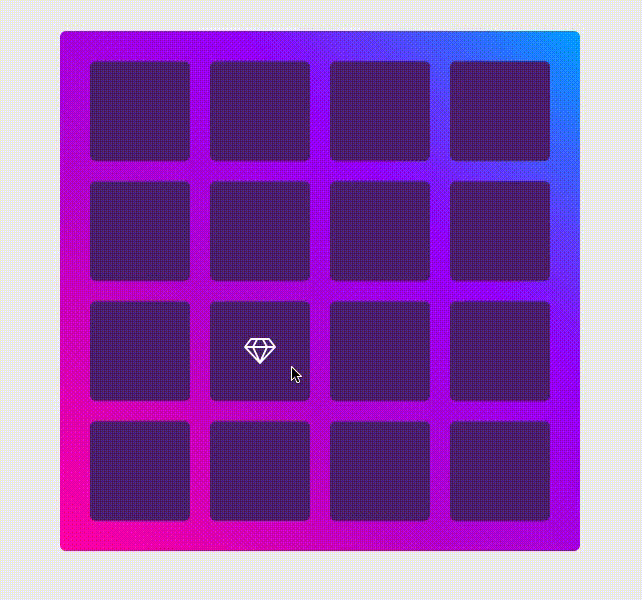

# Concentration 

Test your memory with this memory matching game of concentration. 16 cards are laid facing down. Look for pairs of cards by clicking on them to turn them over, 2 at a time. If you find a matching pair, you may turn over 2 more cards. Turn over all the cards to finish the game.

On game start: 

Game play:

## Built With 
* [React](https://reactjs.org/) - JavaScript library 
* HTML5/CSS3 
* [Font Awesome](http://fontawesome.io/) - Scalable vector icons

## Acknowledgments 
* Reed 

## To Do 
* Successfully exit the message box 
* Keep track of time 
* Keep track of best time 
* Make it live 
* Add flip animation to the cards 
